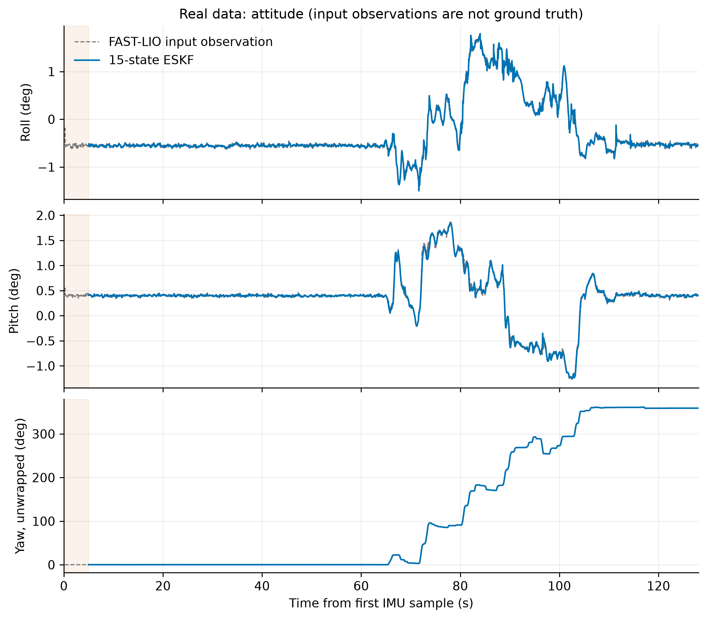
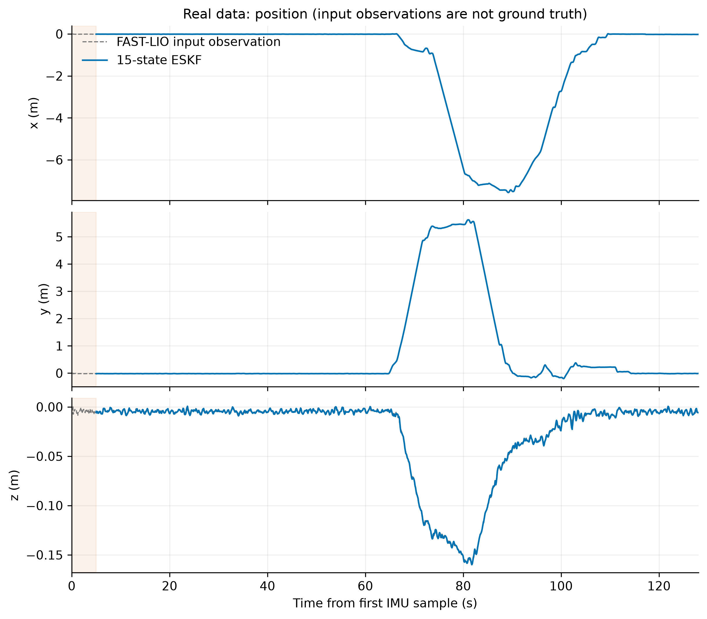
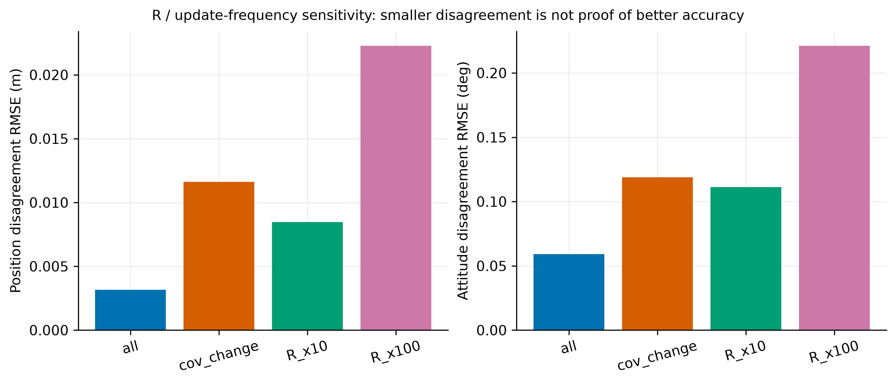
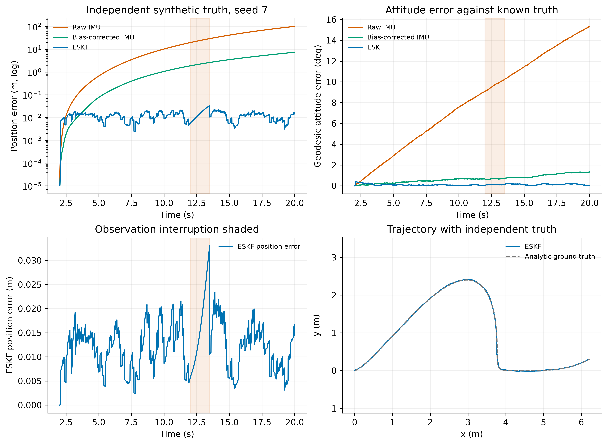

# 技术原稿：基于误差状态 EKF 的 IMU 姿态与位置估计

> 文档分工：[REPORT.pdf](REPORT.pdf) 为 6 页验收报告，[TECHNICAL_APPENDIX.pdf](TECHNICAL_APPENDIX.pdf) 保留完整方法与实验。本 Markdown 是绑定题给两份 CSV 的技术原稿，数据身份由 `results/manifest.json` 中 SHA-256 确定；固定运动分析和审计结论不能直接用于其他数据。最新逐次运行统计以相应 `summary.json` 为准。

本项目完成 `exam.pdf` 第 4—8 页题目二，包括姿态必做部分与位置选做部分。算法使用 IMU 传播、FAST-LIO 位姿观测更新，保存四元数、欧拉角、位置、速度、两类零偏和协方差，并提供六条必需时间曲线。实现采用右乘误差状态扩展卡尔曼滤波器（ESKF）；它属于 EKF，以三维旋转误差进行线性化，同时保留单位四元数标称姿态。

本文明确区分三类依据：**题面与输入坐标约定**、**程序从原始文件测得的事实**、**由数据支持但不能唯一证明的推断**。真实记录没有独立真值，因此与 FAST-LIO 的接近程度仅称“输入观测一致性差异”，不称真实精度，也不据此声称优于 FAST-LIO。

## 1. 原题范围与验收对应

下列清单逐项对应原题，位置选做已经纳入。PDF 中数学公式以页面图像核对，避免纯文本提取漏掉下标、向量或维度。

| 编号 | PDF 页 | 原题要求 | 实现与报告对应 |
|---|---:|---|---|
| R01 | 4—5 | 读取时间、三轴 gyro、三轴 acc | `data_io.py` 支持文件实际列名及题面长列名 |
| R02 | 5 | gyro 为 rad/s，acc 为 g | acc 只在读入时乘 9.81，内部统一 SI |
| R03 | 5 | 位姿文件含位置、xyzw 四元数、36 个协方差元素 | 按字段名读取，按行主序恢复 6×6 矩阵 |
| R04 | 5 | 0—2 为位置、3—5 为 roll/pitch/yaw 方差 | 默认 `rpy` 语义，按欧拉微扰映射到姿态残差坐标 |
| R05 | 5—6 | 时间戳处理、实际相邻间隔与对齐 | 整数纳秒解析；观测事件时先传播再更新 |
| R06 | 5—6 | 初始静止陀螺零偏估计 | 初始窗口均值，配套 IMU 波动和位姿变化检查 |
| R07 | 6 | 位置选做包含加计零偏 | 条件静态初值及在线误差状态估计 |
| R08 | 6 | 必要异常处理 | 坏行、非有限值、冲突时间、零四元数、无效观测方差均有处理或报错记录 |
| R09 | 5—6 | q、bg，选做增加 p、v、ba | 标称状态共 16 个参数，四元数受单位模约束 |
| R10 | 6 | 旋转向量误差及 15 维顺序 | 固定为 `[δp, δv, δθ, δbg, δba]` |
| R11 | 6 | 去 gyro 零偏、四元数积分及归一化 | SO(3) 指数增量右乘单位四元数 |
| R12 | 6 | 位置、速度及重力补偿 | 中点姿态旋转比力，加世界重力后积分 |
| R13 | 6 | 状态与 P 预测，Q 包含两类零偏随机游走 | 连续 F、G 与按实际 Δt 积分的 Qd |
| R14 | 7 | FAST-LIO 姿态与位置作为观测 | 六维位姿观测更新 |
| R15 | 7 | R 来自指定对角项 | 只读取六个原始对角方差，坐标映射后可产生非对角项 |
| R16 | 7 | 残差、K、状态与 P 更新 | 最短旋转残差、线性方程求解、Joseph 形式、误差重置 |
| R17 | 7 | 输出姿态与位置 | `estimates.csv` 含角度、弧度、xyzw 与 xyz |
| R18 | 7 | 六条时间变化曲线 | Roll、Pitch、Yaw、x、y、z；轨迹仅作为补充 |
| R19 | 7 | 完整 EKF 与数据读取代码 | `eskf.py`、`data_io.py`、`run.py` 等完整工程 |
| R20 | 7—8 | 实验及状态、预测、观测、Q/R 说明 | 本报告第 3—9 节与结果目录 |
| R21 | 4 | 实时姿态估计背景 | 因果重放，初始等待与区间缓冲延迟明确记录 |

## 2. 数据审计与适用前提

### 2.1 已确认的信息

题面指定 IMU 约 200 Hz、gyro 单位 rad/s、acc 单位 g；位姿位置单位 m、四元数按 `qx,qy,qz,qw` 存储。两份文件来自同一录制、使用同一时间基准。**输入位姿定义为 IMU 在世界系中的位姿。** 在该输入约定下，无需另加雷达到 IMU 的杆臂变换；若改用其他传感器原点的位姿，必须按其外参转换。坐标约定与协方差导出语义是不同的信息，不能互相替代。

实现采用 Hamilton 四元数、右手坐标系和 ZYX 欧拉角分解，世界重力设为 `[0,0,−9.81] m/s²`。重力方向与欧拉顺序是明确的建模约定；题面没有单独给出地理坐标系或绝对航向信息。输出 yaw 相对于 FAST-LIO 世界系，不等价于地理北向航向。

### 2.2 全量数据事实

| 审计项 | 实测结果 |
|---|---|
| IMU 行数、时长、平均频率 | 25,614 行；128.094403 s；199.9541 Hz |
| Pose 行数、时长、平均频率 | 25,580 行；127.894447 s；200.0009 Hz |
| 重复、倒序时间戳 | 两文件均为 0 |
| 最大 IMU 间隔 | 20.3736 ms，位于开头；大于 10 ms 的间隔共 2 个 |
| 最大 Pose 间隔 | 6.7074 ms |
| 精确共用时间戳 | 25,579 个；另 1 个 pose 时间落在 IMU 区间内 |
| NaN/Inf | 两文件均未发现 |
| 四元数范数范围 | 0.999999305～1.000000690 |
| 四元数等价符号翻转 | 1 次，相对 89.9600 s；不是物理姿态突跳 |
| 全零协方差 | 仅前 20 帧，共 720 个零元素 |
| 非零协方差 | 对角均正；对称误差至多约 1×10⁻¹⁴；最小特征值约 2.9063×10⁻⁸ |
| 协方差保持规律 | 1,279 个连续块，每块恰好 20 行 |
| 协方差变化周期 | 平均 0.100000076 s，约 10 Hz |
| 原始加计模长均值 | 0.998536 g，支持题面单位 |

时间统计按原始时间差计算，表中舍入不用于积分。最终读取器先将十进制秒转换成整数纳秒，再取相对秒，避免先转换较大的 Unix 浮点秒造成精度损失。输入文件哈希及异常计数保存在运行清单中。前 20 帧零协方差不解释为“无误差观测”，也不暗改为任意小正数；初始化使用 1 s 以后数据，运行阶段跳过不具备有效正方差的观测并记录数量。

### 2.3 数据支持的推断及其边界

以相邻姿态的右局部旋转增量对比 gyro 积分，排除约 10 Hz 的修正帧后，有 24,237 个有效区间。三轴仿射映射的对角约为 `[1.000266,1.000643,1.000224]`，非对角绝对值均小于 0.000606；恒等轴加常值偏差的综合残差 RMSE 约 0.0004899 rad/s。它强烈支持 body→world 旋转方向、IMU 轴对应关系和 rad/s 单位，不能当作独立的高精度外参标定。

扣除初始静止 gyro 均值后，相邻姿态增量与 IMU 积分残差平方和的 **99.9737%** 集中在协方差变化帧。这与“约 10 Hz 修正、其间 200 Hz IMU 传播”的机制高度一致。仅靠 CSV 不能还原导出程序，但已足以否定“200 Hz 位姿每帧都是全新、独立外部测量”的前提。

默认实验仍逐帧使用全部有效观测，完整执行题面规定；另外提供按协方差变化帧更新的约 10 Hz 对照。降频减少重复传播信息的使用，但不能消除 FAST-LIO 与本滤波器共享 IMU 导致的相关性。FAST-LIO 官方说明其融合 LiDAR 与 IMU；官方实现信息不能替代本题导出版本与协方差定义的说明。[FAST-LIO 官方仓库](https://github.com/hku-mars/FAST_LIO)

整段记录的 roll 约为 −1.509°～1.775°，pitch 约为 −1.280°～1.856°，主要是平面运动与 yaw 转动。有限倾角激励使重力倾斜、加计零偏和部分标定误差难以充分分离。不能因为滤波输出平滑，就宣称这些物理参数已被唯一、准确识别。

## 3. 姿态表示、李群与误差状态

### 3.1 三种姿态表示

本文以 `C(q)` 表示 body→world 旋转矩阵，观测协方差用 `Robs` 区分。旋转矩阵属于

\[
SO(3)=\{C\in\mathbb R^{3\times3}:C^TC=I,\det C=1\}.
\]

旋转矩阵便于变换向量，但 9 个元素只有 3 个自由度。单位四元数 `q=[qv,qw]` 用 4 个参数表示相同旋转，满足 `qᵀq=1`，且 q 与 −q 等价：

\[
C(q)=(q_w^2-q_v^Tq_v)I+2q_vq_v^T+2q_w[q_v]_\times.
\]

欧拉角便于读图。采用 `C=Rz(ψ)Ry(θ)Rx(φ)`，其中 φ、θ、ψ 分别为 roll、pitch、yaw。令矩阵索引从 1 开始，非奇异处有

\[
\phi=\operatorname{atan2}(C_{32},C_{33}),\quad
\theta=\operatorname{atan2}(-C_{31},\sqrt{C_{11}^2+C_{21}^2}),\quad
\psi=\operatorname{atan2}(C_{21},C_{11}).
\]

pitch 接近 ±90° 时欧拉角奇异，因此积分使用四元数。CSV 同时保存主值 yaw 与展开 yaw；展开只消除绘图时 ±180° 的周期跳变，不增加绝对航向信息。本数据的倾角远离欧拉奇异点。

### 3.2 SO(3) 上的局部扰动

对三维向量 u，叉乘矩阵满足 `[u]×v=u×v`。所有三阶反对称矩阵构成李代数 `so(3)`，以三维旋转向量与其一一对应。令 α=‖u‖，Rodrigues 指数映射为

\[
\operatorname{Exp}([u]_\times)=I+\frac{\sin\alpha}{\alpha}[u]_\times
 +\frac{1-\cos\alpha}{\alpha^2}[u]_\times^2.
\]

相应四元数增量为 `δq(u)=[sin(α/2)u/α, cos(α/2)]`，α→0 时用连续极限。对数映射 `Log` 把相对旋转变为长度不超过 π 的最短旋转向量。这避免直接相减四元数分量；直接相减会错误地区分 q 与 −q。

标称状态为

\[
\hat x=(\hat p,\hat v,\hat q,\hat b_g,\hat b_a),\qquad
\delta x=[\delta p^T,\delta v^T,\delta\theta^T,\delta b_g^T,\delta b_a^T]^T\in\mathbb R^{15}.
\]

平移、速度和零偏采用加法误差；姿态采用**右乘局部误差**：`Ctrue=Ĉ Exp([δθ]×)`。所以 δθ 表示机体系局部旋转误差，不能不经变换与世界系角度误差混用。标称参数为 16 维，P 为 15×15；四元数的单位模约束使两者维度并不矛盾。旋转约定、误差传播和重置机制与误差状态滤波文献核对，以下公式按本项目顺序展开。[Solà，2017](https://arxiv.org/abs/1711.02508)

## 4. 初始静止标定与时间处理

程序等待到相对时间 5.003893137 s 后启动输出，实际标定窗口为 1 s 至该时刻，共 801 个 IMU 样本。丢开最初 1 s 是为避开里程计启动瞬态；使用这段已经到达的数据初始化，不把未来均值倒填为第一帧的在线结果。全段 1～60 s 的静止统计仅用于审计，**没有用于运行初始化或调参回看**。

在标定窗口中，陀螺初值是样本均值。姿态以旋转均值计算，位置取窗口均值，静止速度初始化为零。加计测量是比力，满足

\[
f_m=C^T(a_w-g)+b_a+n_a.
\]

静止且忽略均值噪声时，`mean(fm)=−C0ᵀg+ba`，因此

\[
\hat b_{g0}=\operatorname{mean}(\omega_m),\qquad
\hat b_{a0}=\operatorname{mean}(f_m)+C_0^Tg.
\]

| 参数 | 本次初始化值 |
|---|---|
| bg0，rad/s | `[0.000595577, 0.002456458, 0.016610345]` |
| ba0，m/s² | `[−0.028492806, 0.062259343, −0.056580372]` |
| 世界重力，m/s² | `[0,0,−9.81]` |
| 初始 p、v 标准差 | 各轴 0.02 m、0.05 m/s |
| 初始姿态标准差 | 各局部旋转轴 0.5° |
| 初始 bg、ba 标准差 | 各轴 0.001 rad/s、0.1 m/s² |

ba0 是**以 FAST-LIO 初始姿态和指定重力为条件的估计**。单个静止姿态不能无条件区分倾角误差与加计零偏；初始 P 及后续在线估计保留这项不确定性。P0 中各分量先取所列标准差的平方，初始交叉项设为零，是简化先验，不代表已知真实误差独立。

数据读取会记录非有限行和完全相同的重复行；时间倒序或同一时刻冲突记录会报错，不能静默覆盖。无效四元数被记录并剔除，合法四元数归一化且统一连续符号。运行使用实际 Δt，不强行固定为 0.005 s。观测位于两 IMU 帧之间时，先按该区间 IMU 中点值传播到观测时刻，更新后再传播余下部分；不会插值未来 pose，也不会重复使用同一条 pose。该做法需要当前区间右端 IMU，因而可能有至多一个采样间隔的缓冲。超过 0.1 s 的 IMU 缺口显式报错；较短间隔按至多 0.01 s 的子步传播。

## 5. 非线性状态预测与误差协方差传播

### 5.1 标称状态方程

补偿角速度 `ω=ωm−bg`、补偿比力 `f=fm−ba`。连续模型为

\[
\dot p=v,\quad \dot v=C(q)f+g,\quad
\dot q=\tfrac12q\otimes[\omega,0],\quad
\dot b_g=0,\quad\dot b_a=0.
\]

这里世界加速度是 `Cf+g`。例如机体与世界对齐且静止时，f≈`[0,0,9.81]`、g=`[0,0,−9.81]`，两者相消。把已经定义成负 z 的 g 再减去，会产生错误的两倍重力。

长度 h 的子步采用中点姿态 `Cmid=Ck Exp([ωh/2]×)`，令 `a=Cmid f+g`：

\[
p_{k+1}=p_k+v_kh+\tfrac12ah^2,\quad
v_{k+1}=v_k+ah,\quad
q_{k+1}=q_k\otimes\delta q(\omega h).
\]

偏置标称值在预测期间保持不变，观测时更新。四元数旋转运算返回单位四元数，输出再检查单位模误差。中点积分不是任意大步长的精确解；子步限制用于控制动态区间的离散化误差。

### 5.2 连续误差模型

把右乘误差代入上式，忽略二阶误差乘积，得到

\[
\begin{aligned}
\delta\dot p&=\delta v,\\
\delta\dot v&=-C[f]_\times\delta\theta-C\delta b_a-Cn_a,\\
\delta\dot\theta&=-[\omega]_\times\delta\theta-\delta b_g-n_g,\\
\delta\dot b_g&=n_{bg},\qquad \delta\dot b_a=n_{ba}.
\end{aligned}
\]

令 `n=[ng,na,nbg,nba]`，有 `δẋ=Fδx+Gn`，3×3 分块形式为

\[
F=\begin{bmatrix}
0&I&0&0&0\\0&0&-C[f]_\times&0&-C\\0&0&-[\omega]_\times&-I&0\\0&0&0&0&0\\0&0&0&0&0
\end{bmatrix},\qquad
G=\begin{bmatrix}
0&0&0&0\\0&-C&0&0\\-I&0&0&0\\0&0&I&0\\0&0&0&I
\end{bmatrix}.
\]

姿态误差会通过 `−C[f]×` 影响速度；加计偏置通过 `−C` 影响速度；速度又影响位置。因此位置、姿态与两类偏置的交叉协方差必须传播，不能只更新 P 的对角线。

### 5.3 Q 的定义、单位与离散化

设连续白噪声满足 `E[n(t)n(s)ᵀ]=Qc δ(t−s)`，

\[
Q_c=\operatorname{diag}(\sigma_g^2I,\sigma_a^2I,\sigma_{bg}^2I,\sigma_{ba}^2I),\quad
\Phi(h)=e^{Fh},\quad Q_d=\int_0^h e^{F\tau}GQ_cG^Te^{F^T\tau}\,d\tau.
\]

预测为 `P⁻=ΦP⁺Φᵀ+Qd`。本实现冻结子步中点 F，采用 Φ 的三阶展开，并用三个 Gauss 积分点累加 `B(τ)B(τ)ᵀ`。这种构造保持 Qd 半正定，并包含噪声经速度传播到位置的项；没有把噪声矩阵只乘一个 Δt 后当作全部离散过程噪声。

| 噪声幅值 | 使用值 | 单位及含义 |
|---|---:|---|
| gyro 白噪声 σg | 0.0002328709465 | `(rad/s)/√Hz`，连续噪声模型幅值 |
| acc 白噪声 σa | 0.005162010892 | `(m/s²)/√Hz`，已完成 g→SI 换算 |
| gyro 偏置随机游走 σbg | 0.00001 | `(rad/s)/√s`，配置假设 |
| acc 偏置随机游走 σba | 0.0001 | `(m/s²)/√s`，配置假设 |

前两项由初始化窗口三轴样本方差的均值乘中位采样间隔后开平方估计，即 `density≈sample_std_rms·√Δt`，对应本项目的连续白噪声约定。真实数据包含量化与时间相关性，这不是厂商噪声指标的精确辨识。两类 bias 随机游走参数是显式工作假设，不能从短窗口唯一识别。其方差随时间增长，例如 `Var(Δbg)=σbg²h`；这与标称 `ḃg=0` 不矛盾，后者描述预测均值而非真实偏置绝对不变。

Q 越大，滤波器允许传播误差增长越快；R 越大，观测对状态的修正越保守。二者均是方差或协方差，不能混用标准差，也不能忽略 Δt 的单位。小 Q、小 R 不是精度高的证明。

## 6. FAST-LIO 观测更新

### 6.1 残差与局部线性化

对观测 `(pobs,qobs)`，定义

\[
r=\begin{bmatrix}p_{obs}-\hat p\\\operatorname{Log}(\hat C^TC_{obs})\end{bmatrix},\qquad
H=\begin{bmatrix}I&0&0&0&0\\0&0&I&0&0\end{bmatrix}.
\]

这是小姿态残差附近的 ESKF 观测线性化。H 的姿态块使用 I，不能描述为任意大姿态差下的精确雅可比。系统依靠初始姿态和高频更新保持局部误差小；若输入发生大角度重定位，应扩展为迭代更新或明确重初始化，而不是声称现有一阶模型全局有效。

### 6.2 原始对角方差的坐标映射

按照 PDF，取位置对角 `Dp=diag(cov_00,cov_11,cov_22)`，欧拉角对角 `De=diag(cov_33,cov_44,cov_55)`，单位分别为 m²、rad²。原始位置—姿态交叉项和各轴交叉项不参与默认更新，这是题面指定对角来源下的建模简化。

欧拉角扰动与局部旋转向量并不严格相同。对 ZYX 欧拉角，在观测姿态的 roll φ、pitch θ 处，

\[
\delta\theta_{body}\simeq E(\phi,\theta)\delta e,\qquad
E=\begin{bmatrix}1&0&-\sin\theta\\0&\cos\phi&\sin\phi\cos\theta\\0&-\sin\phi&\cos\phi\cos\theta\end{bmatrix}.
\]

于是局部旋转方差为 `E De Eᵀ`。再考虑非零 Log 残差坐标中的一阶噪声映射，令 `A=Jr⁻¹(rθ)E`，使用

\[
R_{obs}=\begin{bmatrix}D_p&0\\0&A D_e A^T\end{bmatrix}.
\]

右雅可比满足 `Exp(u+du)≈Exp(u)Exp(Jr(u)du)`；其闭式为

\[
J_r(u)=I-\frac{1-\cos\alpha}{\alpha^2}[u]_\times
 +\frac{\alpha-\sin\alpha}{\alpha^3}[u]_\times^2.
\]

接近零时使用级数，防止相消误差。由于题面将后三项明确定义为 roll/pitch/yaw 方差，默认配置为 `rpy`。工程同时提供 `rotvec` 分支，即后三项已经是右局部小旋转方差时令 E=I。**目前没有题目导出程序，不能证明其实际 FAST-LIO 协方差语义与文字定义完全一致；默认实现优先遵循题面。** 若将来确认源数据为其他切空间或世界系旋转扰动，应按定义调整，不能只改字段名称。

### 6.3 增益、注入与协方差重置

创新协方差、卡尔曼增益与误差修正为

\[
S=HP^-H^T+R_{obs},\qquad K=P^-H^TS^{-1},\qquad \widehat{\delta x}=Kr.
\]

代码解线性方程而不显式求逆。p、v、bg、ba 分别加上对应误差修正；姿态更新为 `q⁺=q⁻⊗δq(δθhat)`。Joseph 形式先计算

\[
P_J=(I-KH)P^-(I-KH)^T+KR_{obs}K^T.
\]

姿态注入后，旧误差和新误差不再使用同一个局部原点。重置矩阵为 `T=diag(I,I,Jr(δθhat),I,I)`，最终 `P⁺=T PJ Tᵀ`，并做对称化消除浮点舍入误差。小角下 `Jr(δθhat)≈I−[δθhat]×/2`。仅归一化四元数而不重置 P，会遗漏误差坐标改变的影响。

诊断量 `NIS=rᵀS⁻¹r` 被保存。由于同源误差、时间相关和模型简化，其值不能未经论证就按六自由度卡方分布作严格置信度判定。默认不启用基于 NIS 的观测拒绝，避免靠删除不合意观测掩盖模型差异；接口保留显式阈值选项。

## 7. 实验设计与结果文件解释

真实记录全部实验使用相同初始化与过程噪声，以便比较设置本身的影响。默认主实验逐帧更新，观测方差倍率为 1；补充实验按协方差变化更新、R 乘 10、R 乘 100，以及相对 75—77 s 暂停位姿观测。倍率乘的是**方差**，对应标准差分别乘 √10 和 10。

同时保存两条纯惯导基线：不补偿零偏的积分，以及只补偿初始零偏、不再使用位姿观测的积分。基线从同一初始位姿和速度出发，展示漂移与持续观测的作用；其与 FAST-LIO 的差异仍然不等于独立真值误差。

输出 `estimates.csv` 包含原始时间基准、相对秒、p、v、xyzw、bg、ba、15 个 P 对角项、弧度及角度制 roll/pitch/yaw、展开 yaw；`innovations.csv` 保存更新前残差与 NIS；`summary.json` 保存参数、数量、数值稳定性与计时。姿态差使用相对旋转角，不把三个欧拉角差的平方和直接当作 SO(3) 姿态误差。

实际运行结果如下。每项均输出 24,618 行状态；表中误差列是同一时刻相对于**输入 FAST-LIO 观测**的差异，不是独立真值误差。

| 实验 | 接受观测数 | 对输入位置差异 RMSE，m | 对输入姿态差异 RMSE，° | 平均 NIS |
|---|---:|---:|---:|---:|
| 全部有效帧，R×1 | 24,612 | 0.003158 | 0.059116 | 19.9066 |
| 协方差变化帧 | 1,230 | 0.011617 | 0.118970 | 146.1800 |
| 全部有效帧，R×10 | 24,612 | 0.008451 | 0.111169 | 9.1662 |
| 全部有效帧，R×100 | 24,612 | 0.022287 | 0.221229 | 4.8329 |
| 75—77 s 观测中断 | 24,212 | 0.044716 | 0.065555 | 20.1243 |

主实验进入滤波后没有无效方差帧，因原始 20 个零协方差帧均处于初始化之前；全量审计仍保留“20 帧”的事实，不能把运行计数 0 误读为原始数据没有问题。中断实验按计划跳过 400 个观测。所有设置的 P 在全部输出点均保持正的最小特征值，最小量级约为 2.32×10⁻⁹。

R 增大或观测更新减少时，输出对输入位姿的跟随程度下降。默认观测下的位置一致性差异为毫米量级，但这没有提供毫米级绝对精度的证据。主实验平均 NIS 约 19.91，不能据此声称噪声已校准；同源误差和时序相关已破坏理想白噪声前提。R×100 的平均 NIS 变小也不说明该倍率是真实最优噪声。中断实验全段位置差异增大，说明位置对持续外部约束的依赖，具体中断区间见补充图。

六条要求曲线分别是 Roll-Time、Pitch-Time、Yaw-Time、x-Time、y-Time、z-Time。姿态图注明角度单位，yaw 采用展开值展示连续转动；位置图注明 m 与相对时间 s。三维或平面轨迹只提供空间直观，不替代六条时间曲线。

图1：初始化结束后的三条姿态曲线。FAST-LIO 是滤波输入；图中接近或重合表示一致程度，不能作为独立精度验证。

图2：位置选做的三条必需时间曲线。局部里程计坐标中较小的 z 变化不等于独立测得的高度真值。

图3：相同数据、初始化及 Q 下，改变观测策略和 R 的一致性差异。所有方案共用同一 FAST-LIO 输入，因此不据此评选绝对精度冠军。

补充图件保存了[两类零偏](results/figures/biases.png)、[创新与模型内不确定性](results/figures/innovation_and_model_uncertainty.png)、[纯惯导积分对照](results/figures/integration_baselines.png)以及[两秒位姿观测中断](results/figures/observation_interruption.png)。模型内标准差仅由 P 导出，不应标成经独立真值验证的置信区间。

## 8. 验证、性能与结论边界

### 8.1 数学与物理验证

`validate.py` 的 9 项检查全部通过，明细保存在 `results/validation/summary.json`。关键证据如下；数值是相应测试条件下的结果，不是所有可能输入的全局误差上界。

| 验证项 | 结果 |
|---|---|
| 任意倾角静止重力抵消 | 2 s 后最大绝对位置分量约 3.55×10⁻¹⁵ m |
| 恒定旋转及 q/−q 等价性 | 姿态差约 2.49×10⁻¹⁵ rad；变号前后结果一致 |
| 欧拉角协方差映射有限差分 | 雅可比最大绝对差约 8.33×10⁻¹¹ |
| Qd/Φ 对照 30×30 Van Loan 矩阵指数 | 在 5、10 ms 测试步长，Φ 最大差不超过 2.64×10⁻⁹，Qd 不超过 2.03×10⁻¹⁷ |
| 重置与残差噪声映射有限差分 | 最大绝对差分别约 1.86×10⁻¹¹、2.44×10⁻¹¹ |
| 传播协方差与状态导数 | 0.1 ms 局部测试最大差约 2.50×10⁻¹² |
| 观测更新及零方差处理 | 后验对称、最小特征值为正；零观测方差被拒绝 |
| 1.5 s 观测中断 | 位置方差迹由 0.03 增至 3.18208，传播不确定性增长 |
| 合成解析轨迹导数核验 | 速度、加速度、机体系角速度导数差均小于 3.53×10⁻¹⁰ |

流程验证结果另保存在 `results/validation/pipeline_checks.json`。流程包含单帧 IMU 校准拒绝检查，避免 `ddof=1` 方差返回 NaN；原有列别名、整数时间、异步更新、零协方差和 CSV 回读检查继续保留。

### 8.2 具有独立已知真值的合成实验

使用固定随机种子 7、29、113，每次 20 s，IMU 为 200 Hz，位姿观测为 10 Hz，12—13.5 s 暂停观测。前 2 s 为已知静止初始姿态下的零偏初始化，不计入评分；每次评分 3,601 个样本，融合 165 次观测。运动轨迹及姿态是显式解析函数，并独立以数值导数核验。IMU 使用区间中点采样，在区间终点提供；不插值未来 pose。

该实验设定 IMU 与位姿噪声独立、真实偏置恒定、初始姿态已知。它验证受控模型下的滤波行为，不复现真实 FAST-LIO 同源相关性，也不验证任意传感器失效。三次运行 RMSE 的算术均值如下，不是置信区间：

| 方法 | 位置真值 RMSE，m | SO(3) 姿态真值 RMSE，° |
|---|---:|---:|
| 原始 IMU 积分 | 40.956552 | 9.234228 |
| 仅补偿初始零偏的 IMU 积分 | 3.724249 | 0.746249 |
| 本 ESKF | 0.014930 | 0.143033 |

ESKF 三个种子的单次位置 RMSE 为 0.013237、0.015583、0.015969 m，姿态 RMSE 为 0.136476、0.134857、0.157767°。结果支持在已声明的模拟条件下，持续位姿观测能抑制纯积分漂移。它不支持把真实记录的绝对精度写成 1.5 cm 或 0.14°。

图4：固定种子合成实验的误差。只有这一类已知真值实验使用“真实误差”表述；真实 FAST-LIO 记录的图表使用“输入观测差异”。

### 8.3 数值稳定性与运行性能

主实验在全部 24,618 个输出点检查 P：最小特征值为 2.31705×10⁻⁹，对称误差为 0，四元数模长最大误差为 2.22×10⁻¹⁶。这里的正性是数值稳定性证据，不证明 P 已经与物理误差统计一致；对称化本身也不能修正错误的噪声模型。

本次环境为 Windows 11、Python 3.12.14、NumPy 2.5.3。主实验重放总耗时 13.8555 s，处理率 1,776.7 个 IMU 区间/s；它包含滤波、两条积分基线和逐输出特征值检查，不含 CSV 读取、保存与绘图。每步滤波及基线计时的中位数为 0.4595 ms、p99 为 0.9825 ms、此次最大值为 2.1641 ms；逐输出完整检查包含在总耗时中，不包含在这组每步计时中。

这些实测结果支持本机器对此记录具有超过 200 Hz 的平均重放处理能力。数据到达、操作系统调度、传感器通信和图形显示未纳入实时闭环测试；普通 Windows 环境不能据一次运行的最大值给出硬实时最坏延迟保证。初始化仍需约 5 s，区间插值仍需最多一个 IMU 周期缓冲。

本项目包含：题面要求的姿态与位置 ESKF 实现、可重放数据管线、透明的参数与异常处理、真实数据输出、合成验证和可检查的实验过程。以下结论需要额外依据，不能从现有数据推出：

1. **绝对精度或优于 FAST-LIO。** 需要与本 IMU/FAST-LIO 独立的运动捕捉、测量基准或可靠真值。
2. **后验 P 等于真实误差协方差。** 本实现没有 FAST-LIO 与本滤波器的交叉协方差；重复使用共享 IMU 信息会使独立噪声假设偏乐观。
3. **调小 R 即提高精度。** 它会让输出更贴近输入观测，却可能只是在复现其噪声和误差。R 敏感性实验用于揭示依赖程度，不用于挑选最漂亮的数字。
4. **单姿态初值等于完整标定。** ba 与重力、姿态误差耦合，且本段滚转/俯仰激励较弱；在线零偏是当前模型下的有效估计。
5. **观测中断后不会漂移。** 速度与位置依赖积分，小倾角和加计偏置可产生显著位置误差；短时间中断测试不能保证任意长失锁。
6. **局部 yaw 可约束等于绝对地理航向已知。** 姿态观测约束的是 FAST-LIO 的世界参考；没有额外绝对航向源时不能推导地理北向。

## 9. 主要来源与可追溯性

- **原题 `exam.pdf`，第 4—8 页。** 第 4—5 页定义背景、数据、单位；第 5—6 页定义标称状态与误差维度；第 6 页规定预处理和预测；第 7 页规定观测、曲线及交付；第 8 页补充状态、模型和 Q/R 说明要求。该文件是需求依据，原始数据及题面均未修改。
- **输入坐标约定。** pose 表示 IMU 在世界系中的位置与方向；世界系、局部扰动及单位定义贯穿读取、预测、更新和输出。
- **全量数据审计。** 数字由原始 CSV 计算，最终运行清单保存原始文件 SHA-256、版本、参数和异常计数，便于核对复现。
- Joan Solà，*Quaternion kinematics for the error-state Kalman filter*，2017。[论文页面](https://arxiv.org/abs/1711.02508)。用于核对旋转扰动和 ESKF 的约定；本文按自己的状态顺序推导和说明公式。
- HKU-MARS，FAST-LIO。[官方仓库](https://github.com/hku-mars/FAST_LIO)。用于核对其激光—惯性融合性质；官方当前代码不能证明本题 CSV 导出版本或实际协方差语义。

## 10. 姿态六维误差模型与诊断解释

### 10.1 姿态必做的数学形式

仅研究姿态和陀螺零偏时，标称状态为 $(q,b_g)$，误差状态为 $\delta z=[\delta\theta^T,\delta b_g^T]^T$。采用相同右局部旋转误差约定，连续模型可写成：

$$
F_6=\begin{bmatrix}-[\omega]_\times&-I_3\\0&0\end{bmatrix},\qquad
G_6=\begin{bmatrix}-I_3&0\\0&I_3\end{bmatrix},\qquad
Q_{c,6}=\operatorname{diag}(\sigma_g^2 I_3,\sigma_{bg}^2 I_3).
$$

$$
P_6^-=\Phi_6 P_6\Phi_6^T+Q_{d,6},\quad
Q_{d,6}=\int_0^{\Delta t}e^{F_6s}G_6Q_{c,6}G_6^Te^{F_6^Ts}\,ds,\quad
H_6=[I_3\quad0].
$$

姿态残差仍为 $\log(\hat R^T R_{obs})$，观测噪声仍需按输入协方差坐标映射。姿态注入重置为 $G_{reset,6}=\operatorname{diag}(J_r(\widehat{\delta\theta}),I_3)$。这些式子说明独立姿态基线如何建立，不意味着当前 15 维程序可通过把位置、速度和加计零偏置零而退化：其传播交叉协方差和位置更新仍可能影响姿态。

### 10.2 NIS 的量级及不能据此推出的原因

本记录主实验的平均 NIS 约 19.9066；在零均值且创新协方差正确的理想六维模型下，名义期望为 6，比值约 3.3178。65–105 s 窗口的 NIS 均值约 51.0221，99% 分位数约 402.6462，最大值约 1269.1546。相应可复算统计保存于 `results/all/diagnostics.json`。这些数字表明当前模型与观测统计存在失配，不能仅凭它们定位失配来源。

候选解释包括过程/观测噪声参数失配、未纳入的同源交叉相关、跨时刻相关性、未辨识的时间偏差或其他模型误差。目前没有独立同步标定或温度记录，无法把时间偏移确定为主要原因；采用 IMU 原点位姿约定时，也不应把未知杆臂直接列为已存在的缺陷。现有数据没有提供选择唯一原因的充分证据。

图中的 $\sqrt{P_{\theta_z\theta_z}}$ 是一维右局部旋转误差的模型标准差，不是严格的 Euler yaw 标准差。三维姿态测地输入差是更新后的输出与观测差异，而六维 NIS 使用更新前创新及其 $S$；三者不能直接相除来断言“自信度差一个数量级”。

### 10.3 偏置状态与重合曲线

`biases.png` 展示模型估计的有效偏置状态。弱倾角激励下，状态可能吸收姿态先验误差、模型简化或观测误差，不能直接解释成独立测得的物理零偏变化。没有器件规格、温度或振动记录，不能断言“40秒内真实MEMS零偏不可能这样变化”。加速度拟合的条件数约 566.7 说明参数分离较弱；其等效比例系数不是传感器独立标定结果。

姿态和位置图中输入与估计曲线非常接近，部分虚线被覆盖；对应差异已分开展示在 `trajectory_and_input_difference` 图中。起点采用空心圆、终点采用较小叉号，以便闭合路径中同时辨认。
